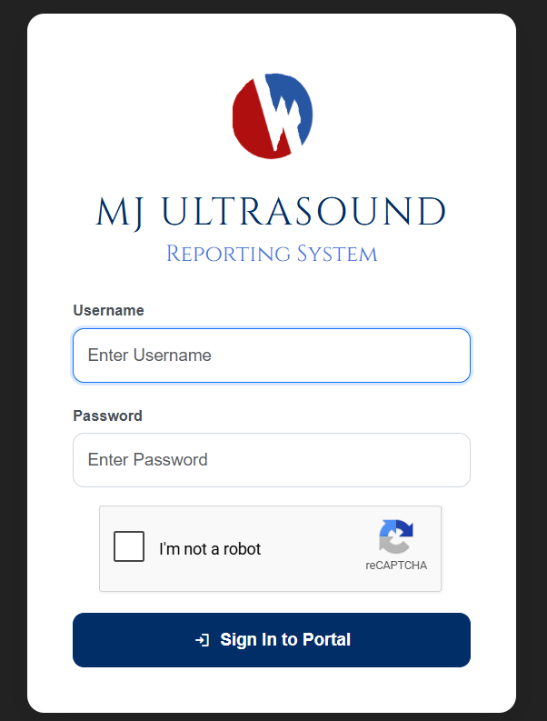
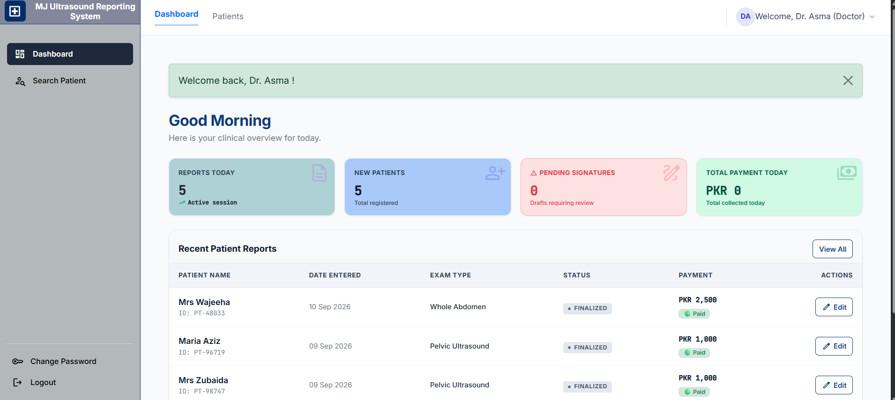
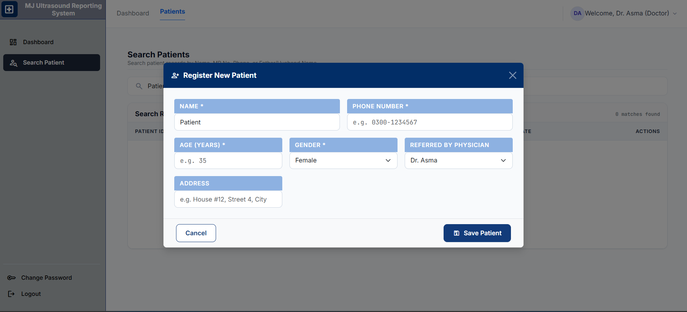
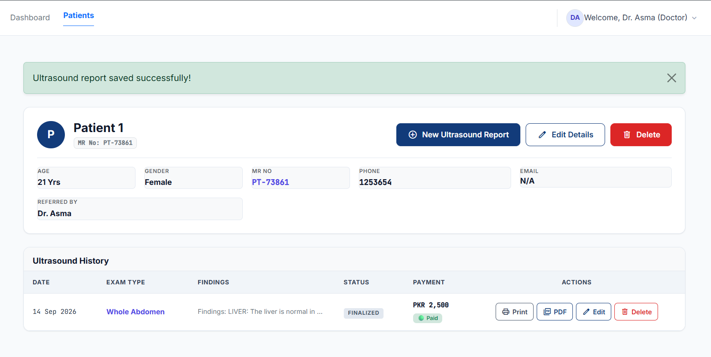
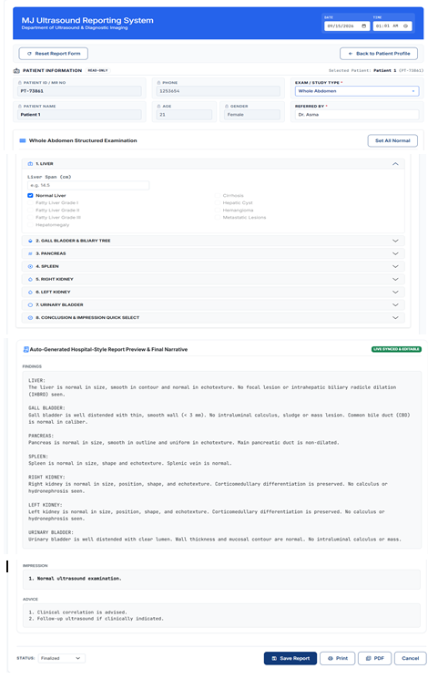
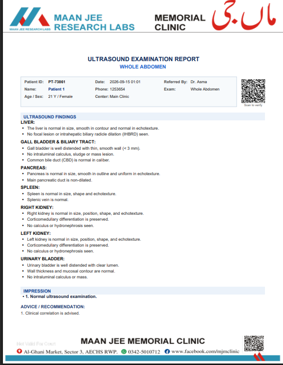
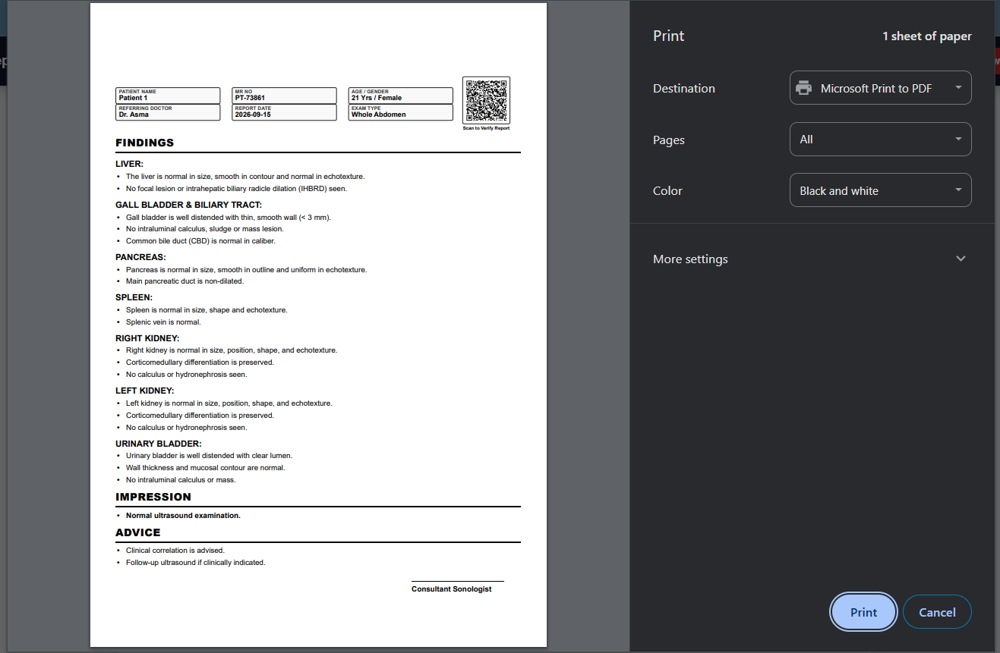

# Maan Jee Ultrasound Reporting System

A professional web-based healthcare application developed to streamline
patient management and ultrasound reporting workflows in a clinical environment.

## Project Status

**Currently deployed and in use at Maan Jee Memorial Clinic.**

The system was developed to support real-world clinical workflows,
including patient management, ultrasound examination selection,
structured reporting, and report generation.

## Key Features

- Secure Doctor and Admin authentication
- Role-based access control
- Google reCAPTCHA protection for authentication/security
- Patient registration and management
- Patient search and history
- Ultrasound study selection
- Structured organ-wise ultrasound reporting
  **Dynamic checkbox-based reporting:**
-  Doctors can select predefined clinical findings, and the system automatically generates corresponding standardized report text
- Predefined clinical findings for faster and more consistent reporting
- Editable ultrasound report templates
- PDF report generation
- Professional report letterhead
- Report printing
- QR code generation and scanning functionality
- Administrative management
- Audit tracking
- Responsive user interface
- Production-ready clinical workflow

## Ultrasound Modules

The system supports structured reporting for:

- Whole Abdomen
- Upper Abdomen
- KUB
- Pelvic Ultrasound
- Obstetric Ultrasound
- Obstetric TVS / Early Pregnancy TVS

## Technology Stack

- **Backend:** Python, Flask
- **Frontend:** HTML5, CSS3, JavaScript, Bootstrap
- **Database:** neon postgresql
- **Architecture:** Flask-based web application
- **APIs:** REST APIs
 ## Security & Integrations

- Google reCAPTCHA
- QR Code functionality
- Role-based authentication
- PostgreSQL database hosted on Neon

## Application Workflow

1. Doctor/Admin logs into the system
2. Patient information is registered or retrieved
3. Ultrasound examination is selected
4. Relevant reporting template is loaded
5. Doctor enters and edits findings
6. Report is saved to the database
7. Professional PDF report is generated
8. Report can be printed for clinical use

## Screenshots

### 1. Secure Login



### 2. Dashboard



### 3. Patient Registration



### 4. Patient Profile & Management



### 5. Ultrasound Reporting



### 6. Generated PDF Report



### 7. Print Preview




## Project Structure

```text
mj-ultrasound-reporting-system/
├── routes/
├── src/
├── static/
├── templates/
├── app.py
├── config.py
├── README.md
└── requirements.txt
